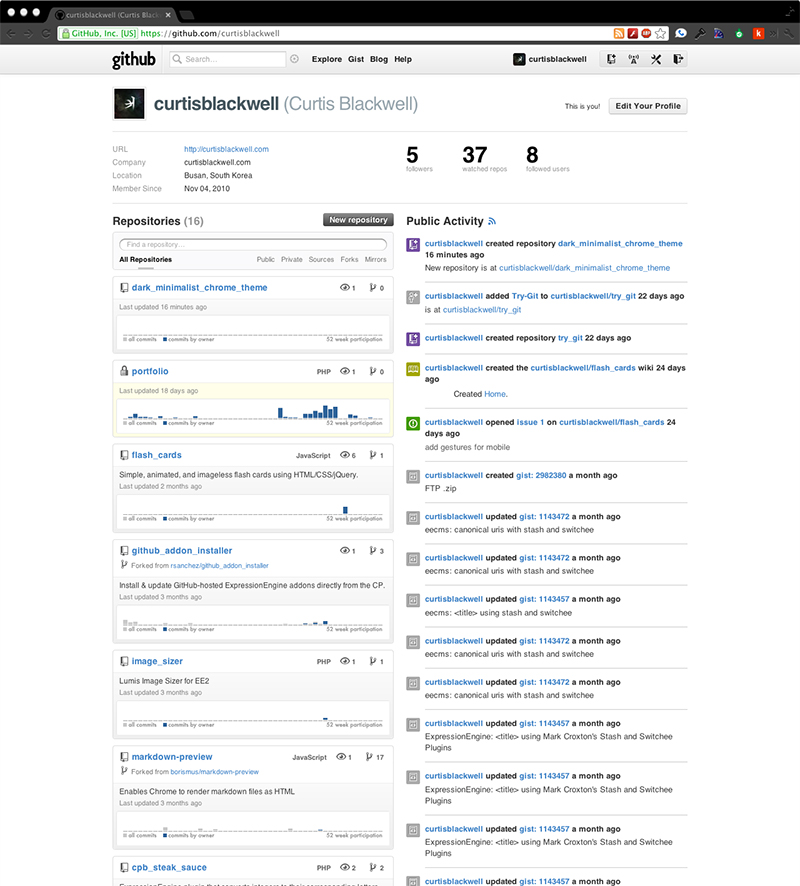

# How to Install
1. Download and unzip files.
2. Go to [Extensions](chrome://chrome/extensions/) in Chrome.
3. Click the **Developer mode** checkbox.
4. Click the **Pack extension…** button.
5. Click the **Browse…** button next to **Extension root directory** and choose the `dark_minimalist` folder.
6. Click **Pack Extension**.
7. Drag the newly created `dark_minimalist.crx` (should be next to the `dark_minimalist` folder) into your Chrome window and click **Add** when the prompt appears.